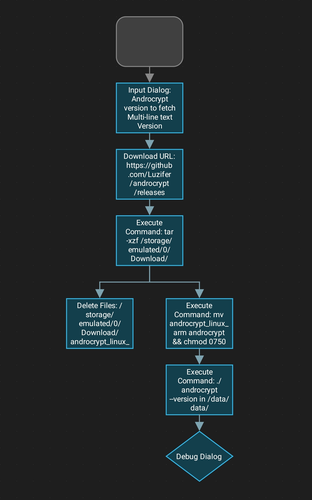

# Luzifer / androcrypt

`androcrypt` is a small single-binary wrapper around my [go-openssl](https://github.com/Luzifer/go-openssl) library to perform de-/encrypt operations on an Android device.

My use-case is especially having [Automagic](https://play.google.com/store/apps/details?id=ch.gridvision.ppam.androidautomagic) to be able to decrypt data fetched from the internet.

## Installation

As on Android (in my case Android 10) everything is sandboxed and the `/sdcard/` is mounted having a `noexec` flag it wasn't as easy to install as I thought. To get the binary to be executable I needed an Automagic workflow to write the file into the Automagic data dir (`/data/data/ch.gridvision.ppam.androidautomagic/...`) and make it executable.

This is the flow to be imported into Automagic (click for XML):

